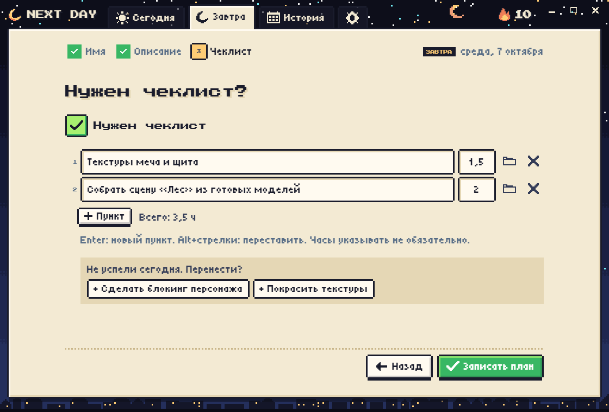
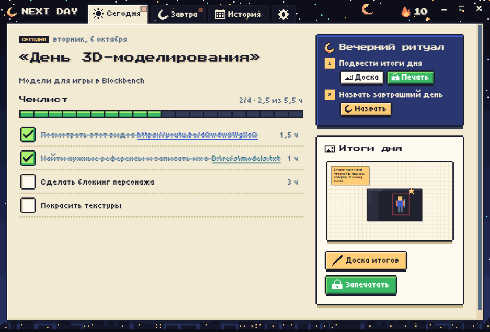
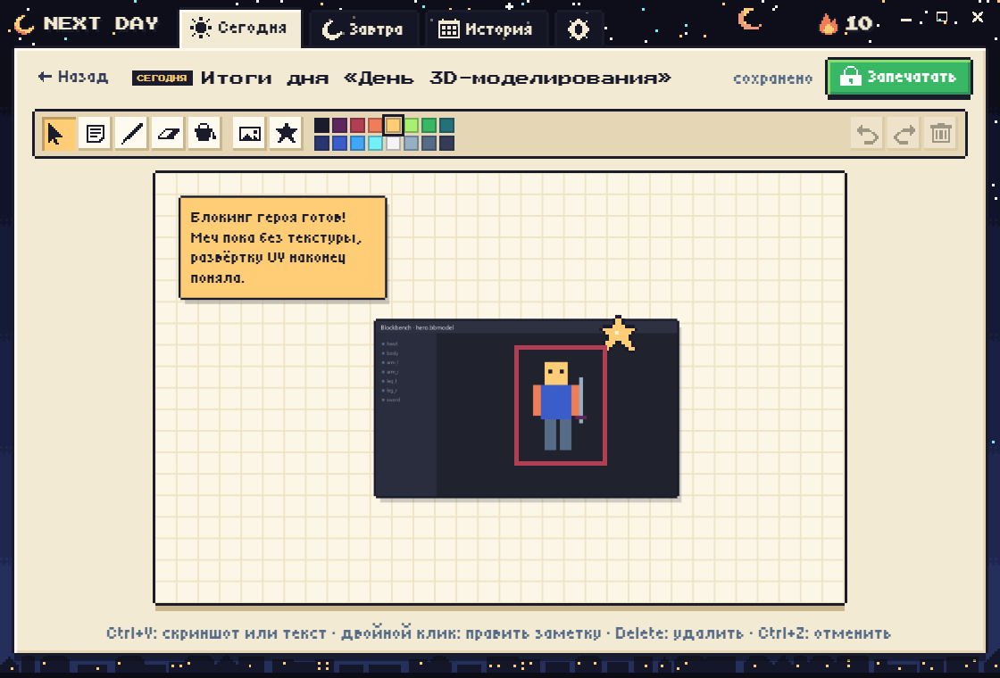
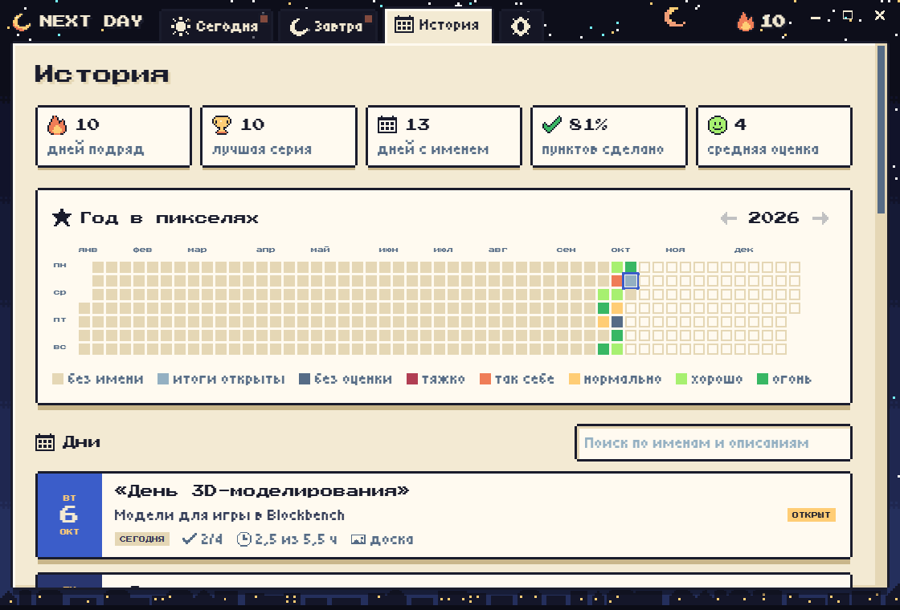
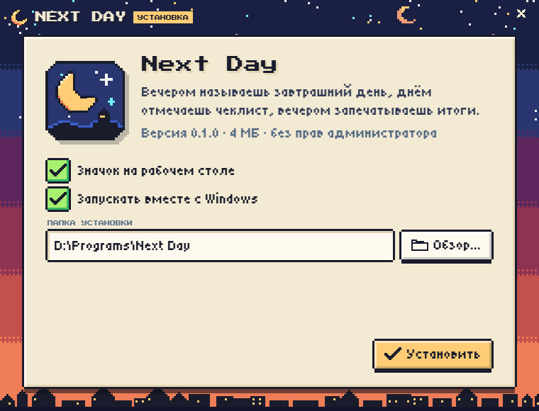

# Next Day

Планировщик на один день вперёд для Windows.

Вечером программа спрашивает, как назвать завтрашний день и чем вы будете заниматься. Можно добавить чеклист, указать часы на каждый пункт и время, когда его начинать. Днём отмечаете сделанное, вечером собираете итоги на доске: сделанные пункты, скриншоты, заметки, рисунки. Потом день запечатывается и остаётся в истории, менять его уже нельзя.

На вкладке «Часы» видно, какая задача стоит на какой час, а когда этот час наступает, приходит напоминание.

Планировать можно только завтрашний день, один план на день.

Программа запускается вместе с Windows, живёт в трее и напоминает о себе утром и вечером.









## Установка

Скачайте установщик из раздела Releases и запустите. Права администратора не нужны, папку можно выбрать.



Новые версии программа ставит сама, пока окно спрятано в трей. Автообновление можно выключить в настройках.

Удалить программу можно через «Приложения» Windows.

## Сборка

Нужны Node.js и Rust.

```
npm install
npm run release
```

Установщик появится в `release/NextDaySetup.exe`.

Если есть ключ подписи `~/.tauri/next-day.key`, рядом появится `latest.json`. Его нужно приложить к релизу вместе с установщиком, тогда установленные программы обновятся сами.

Запуск для разработки:

```
npm run tauri dev
```

## Лицензия

MIT
